<p align="center">
  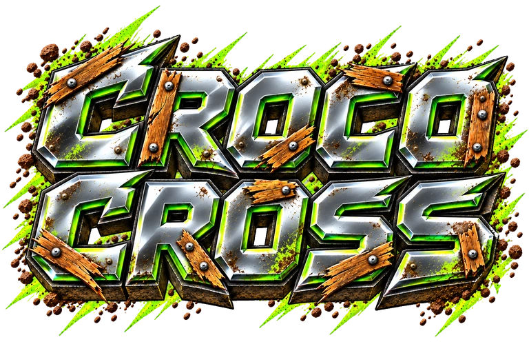
</p>

<h1 align="center">Two pedals. Nine worlds. One more ride.</h1>

<p align="center"><strong>A colorful motorcycle adventure for iPhone and iPad.</strong><br>An articulated crocodile rider · Illustrated landscapes · Weekly challenges · Endless rides</p>

CrocoCross is about finding your rhythm: accelerate into a hill, balance in the air, and land ready for the next jump. Ride with Rocco, explore a new landscape, and turn a short break into one more attempt at your personal best.

**Free by design. No ads. No in-app purchases. No separate game account.**

## Canyon first

Canyon is the only selectable world in this preview. The other eight worlds are retained for future artwork and motion updates. The gallery below shows the earlier world artwork.

<table>
  <tr><th>Paris</th><th>San Francisco</th><th>Old Gold Mine</th></tr>
  <tr>
    <td>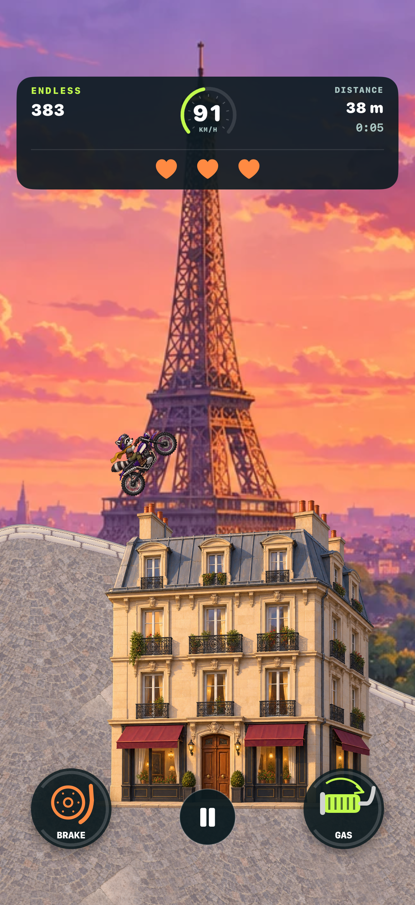</td>
    <td>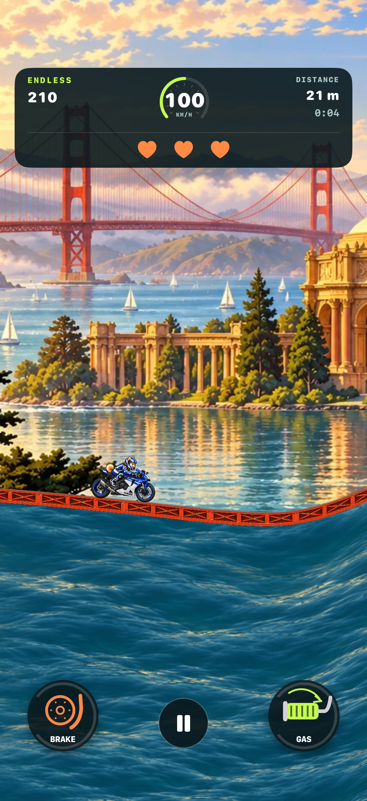</td>
    <td>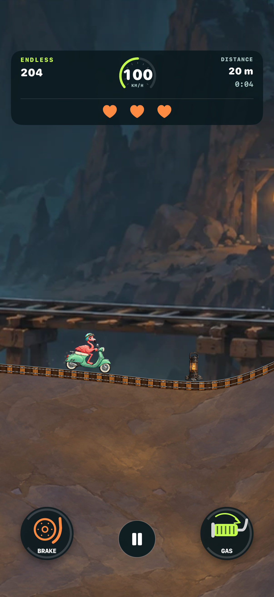</td>
  </tr>
  <tr><th>Canyon</th><th>Japan Mountains</th><th>Arctic Aurora</th></tr>
  <tr>
    <td>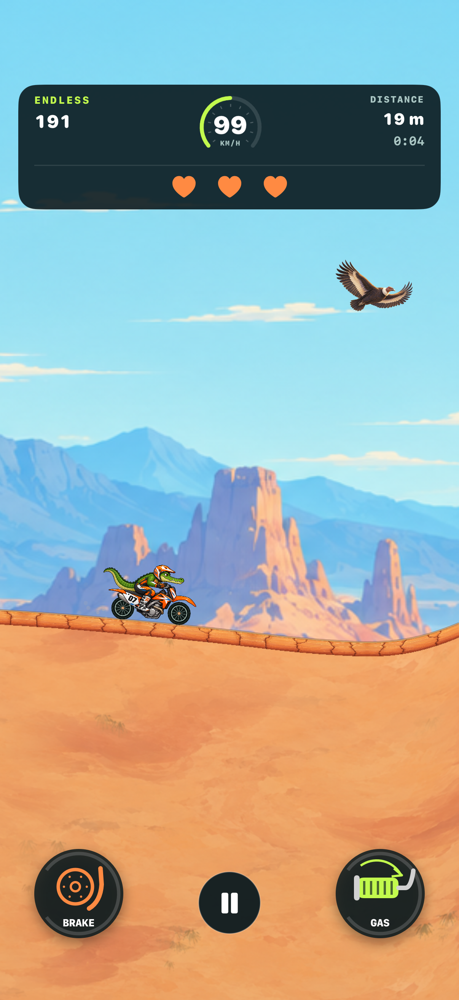</td>
    <td>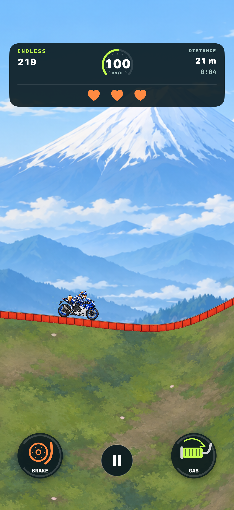</td>
    <td>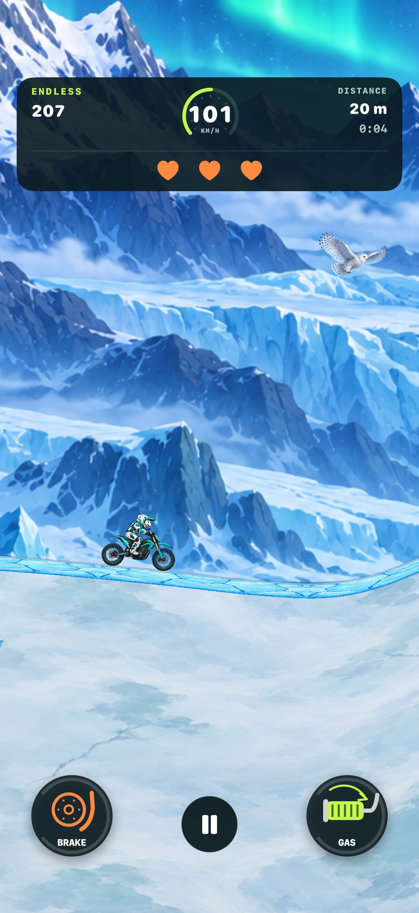</td>
  </tr>
  <tr><th>American Sunset</th><th>Tropical Jungle</th><th>Cloud Nine</th></tr>
  <tr>
    <td>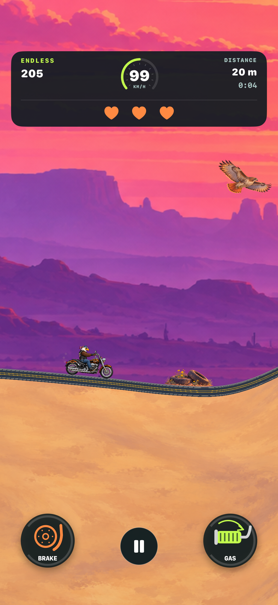</td>
    <td>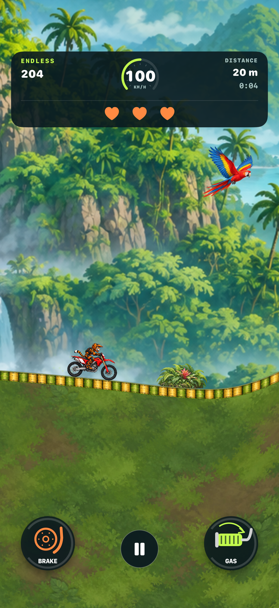</td>
    <td>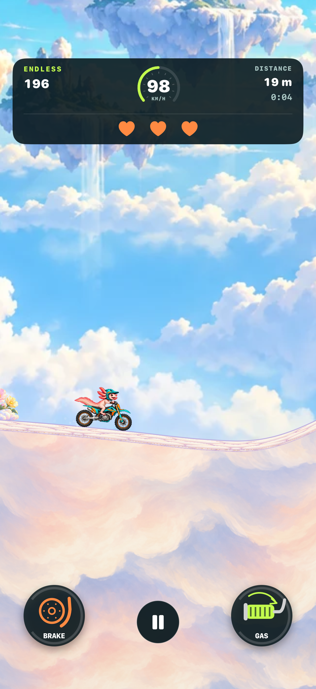</td>
  </tr>
</table>

*Scenery screenshots from native build `e843dc5`, captured on an iPhone 17 simulator on September 13, 2026, before the illustrated-button refresh. See [capture details](docs/images/mobile/README.md).*

Every world has its own riding surface and scenery: mine rails, Parisian paving, a vermilion bridge over the bay, ice and bamboo. Pigeons cross Paris, boats populate San Francisco, and larger foreground objects can briefly pass in front of the rider. Backdrops, objects and the camera create depth as you ride.

## Choose your challenge

| | Weekly | Endless |
| --- | --- | --- |
| **The goal** | Complete a shared 4,000 m trail | Ride as far as you can |
| **Lives** | One | Three |
| **The course** | A new challenge every Monday at 00:00 UTC | Procedural hills that keep unfolding |
| **Your next target** | A clean finish, a higher score, a faster time | Distance, stunts and personal bests |

There is no time limit on the weekly trail. Both Endless and weekly practice work offline. Apple Game Center supplies optional online competition; a ranked weekly attempt requires a confirmed active event before starting.

## Ride with Rocco

Rocco is the first rider with an articulated body and a motorcycle simulated separately. The other eight characters are temporarily disabled while their artwork and movement are adapted. Canyon is the only selectable world while the other eight backgrounds are reworked.

<p align="center">
  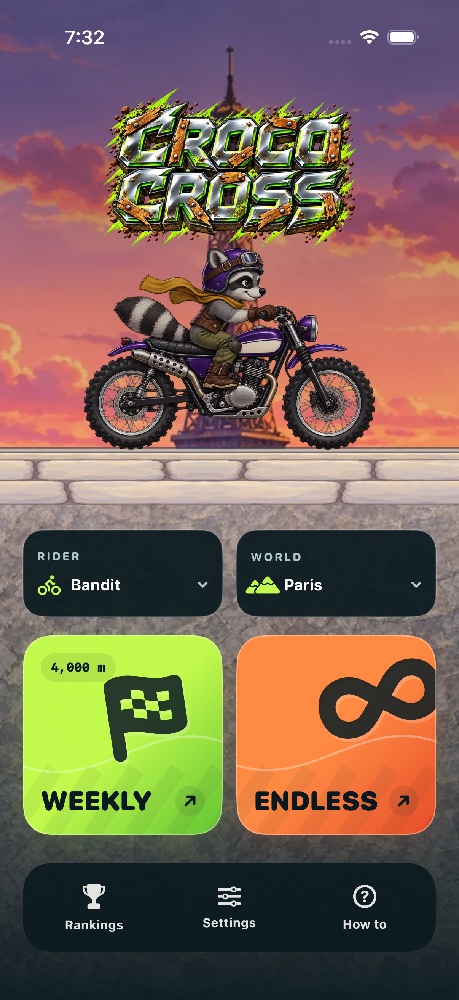
</p>

## Simple controls, satisfying landings

<p align="center">
  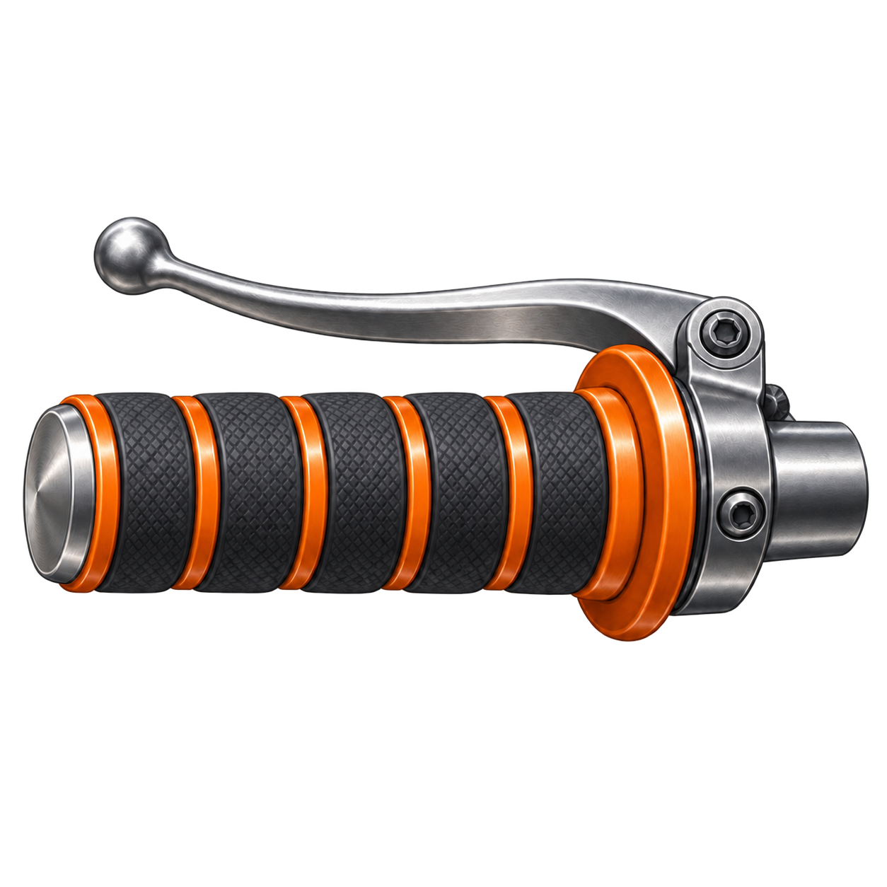
  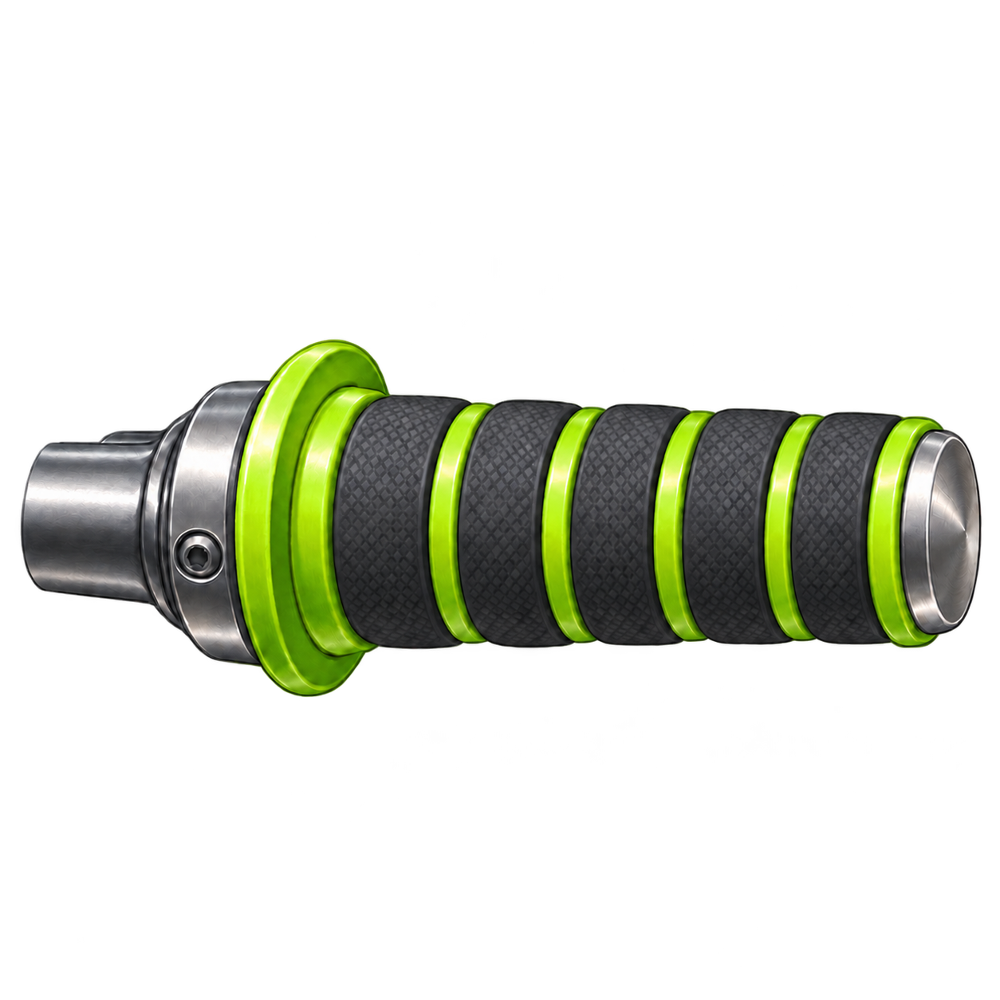
</p>

- **Right pedal:** accelerate, lean backward on one wheel and rotate backward in the air.
- **Left pedal:** brake, lean forward on one wheel and rotate forward in the air.
- **Hold and release:** each illustrated button applies full power while held. Lift to stop; use short presses for finer control.

[See the current buttons in-game](docs/images/controls-iphone.png). Their rims respond to each press; the handlebar images stay free of text and arrows.

Traction, suspension, slope and momentum shape each jump. A flip earns points after a safe landing. Tap Pause to take a break and Keep riding to continue; returning Home or leaving the app ends the current run.

Choose music and sound levels in Settings, adjust haptics, and keep your personal records on the device. The interface adapts to iPhone portrait and iPad landscape layouts.

## Build and development

The project is a native **Swift 6 / SwiftUI / SpriteKit** app for **iOS and iPadOS 18+**. A local Swift package owns the deterministic 120 Hz simulation, terrain, suspension, traction and scoring. SpriteKit draws the game; SwiftUI supplies its menus and controls. Box2D 3.1.1 is vendored under its MIT License in the local Swift package. There are no remote Swift package dependencies or third-party analytics SDKs.

Use macOS and **Xcode 26.6**, the validated toolchain. Open `CrocoCross.xcodeproj`, select the **CrocoCross** scheme and choose a simulator. Physical-device builds require an Apple signing team; the project currently contains the owner's team setting.

```sh
git clone https://github.com/daviddemri26/CrocoCross-iOS.git
cd CrocoCross-iOS
swift test --disable-sandbox
xcodebuild -project CrocoCross.xcodeproj -scheme CrocoCross \
  -destination 'generic/platform=iOS Simulator' \
  -derivedDataPath /tmp/crococross-derived CODE_SIGNING_ALLOWED=NO build
```

| Directory | Contents |
| --- | --- |
| `App/` | Native interface, rendering, services and bundled art/audio |
| `Sources/CrocoCrossCore/` | Box2D integration, snapshots and game rules |
| `ThirdParty/Box2D/` | Pinned engine source, MIT license and provenance |
| `Tests/` / `UITests/` | Core and native interface checks |
| `docs/` | Development, artwork, validation and release documentation |
| `scripts/` | Project generation and focused checks |

**Development status:** the `box2d-1` migration replaces the custom physics engine with vendored Box2D 3.1.1 and separates Rocco from the motorcycle. Rocco is the first playable articulated rider; the other eight characters remain in source for later adaptation. Canyon is the only selectable world while the other eight backgrounds are reworked. See the [migration plan](docs/BOX2D-MIGRATION.md) and [validation record](docs/VALIDATION.md) for measured checks and device status. This repository does not currently provide an App Store or TestFlight download.

GitHub Actions runs core tests, persistence, competition-version isolation and audio checks, project consistency, and a simulator build. It does not publish the app. Live leaderboard submission/read-back, remaining device checks and distribution are tracked in the [release checklist](docs/RELEASE.md).

## Project information

- [Development](docs/DEVELOPMENT.md) · [Contributing](CONTRIBUTING.md)
- [Artwork and scenery](docs/SCENERY.md) · [Object sizes](docs/SCENERY-SIZES.md) · [Game Center setup](docs/GAME-CENTER-SETUP.md)
- [Changelog](CHANGELOG.md) · [Privacy draft](docs/PRIVACY-POLICY-DRAFT.md) · [Security](SECURITY.md)
- [Asset provenance](docs/SOURCE-PROVENANCE.md) · [Rights and usage](RIGHTS.md)

Created by **David Demri**. Publication of this repository does not grant an open-source license or downstream rights to its media. This native edition is independent of the original CrocoCross web project.
