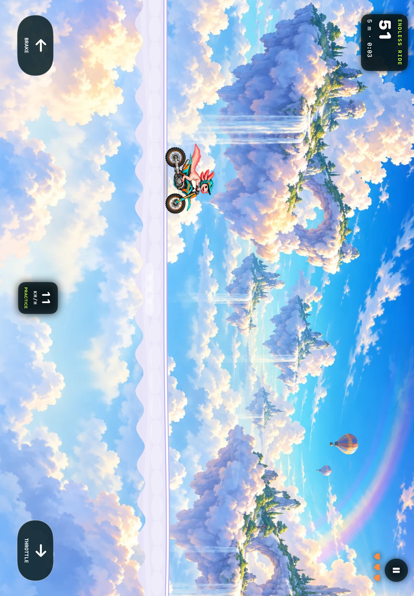

<p align="center">
  
</p>

<h1 align="center">One more hill. One cleaner landing. One more ride.</h1>

<p align="center"><strong>A colorful motorcycle adventure for iPhone and iPad.</strong><br>9 animal riders · 9 illustrated worlds · Weekly trails · Endless rides</p>

CrocoCross turns two simple touch controls into a game of momentum, balance and satisfying landings. Choose your animal rider, find your rhythm across rolling hills, and make the next run your best yet.

**Free to play by design. No ads. No in-app purchases. No separate CrocoCross account.**

> **In development:** this repository contains the native iOS development candidate. There is no public App Store or TestFlight download linked yet. Game Center integration is implemented; live leaderboard configuration and score verification remain release milestones.



*Actual iPad simulator capture from the development build, September 12, 2026.*

## Ride your way

### A fresh challenge every week

One trail. **4,000 metres. One life.** Learn the hills, commit to a jump, and keep your nerve all the way to the finish. There is no time limit, so you can build confidence before chasing a faster completion. A new course arrives every Monday at 00:00 UTC.

Weekly practice works offline. Online competition uses Apple Game Center and requires a confirmed, active weekly event before the run starts.

### Keep going in Endless

Start with **three lives** and see how far your riding takes you. Procedural hills keep the route unfolding, while local records give you a reason to return. Ride for distance, land a clean flip, or simply enjoy the scenery.

### Pick a personality. Change the scenery.

Meet Rocco the crocodile, Kenji the Shiba Inu, Duke the eagle, Axel the tiger, Bjorn the polar bear, Pinky the flamingo, Rio the toucan, Bandit the raccoon and Bubbles the axolotl.

Explore Canyon, Japan Mountains, American Sunset, Tropical Jungle, Arctic Aurora, Old Gold Mine, San Francisco, Paris and Cloud Nine. Illustrated backdrops, parallax, ambient animation and textured trails give each world its own mood.

**Every rider shares the same physics.** Pick the look you love; success comes from how you ride.

## Simple controls, room to improve

- **Right pedal:** accelerate on the ground; rotate backward in the air.
- **Left pedal:** brake on the ground; rotate forward in the air.
- **A lighter touch:** hold a pedal and slide downward to reduce its strength. Release to stop the input.

Speed, slope and balance shape every jump. Rear-wheel traction creates natural wheelies, suspension absorbs contact, and a flip counts only after a safe landing.

## Made for the ride

- **Play offline:** Endless and weekly practice stay available without signing in.
- **Come back to your run:** local saves restore an unfinished ride in a paused state.
- **Set the mood:** adjust music, engine sounds, effects and haptics independently.
- **Phone or tablet:** portrait play on iPhone and landscape play on iPad.
- **Optional competition:** Game Center integration targets weekly score, fastest weekly finish and Endless score. Live service validation is still pending.
- **Local storage:** settings, personal records and saved rides stay on the device; eligible online scores use Apple's Game Center. No custom backend or third-party analytics SDK is included.

## Under the hood

CrocoCross is a native **Swift 6, SwiftUI and SpriteKit** app targeting **iOS / iPadOS 18 or later**. It uses Apple's frameworks and a local Swift package, with no remote package dependencies.

The portable `CrocoCrossCore` package owns a deterministic **120 Hz simulation**, procedural terrain, suspension, traction, stunt scoring and weekly course seeds. SpriteKit renders the world; SwiftUI manages menus and the surrounding interface. Native services handle audio, haptics, local persistence and Game Center.

```text
App/                      Native app, UI, scenes and services
Sources/CrocoCrossCore/    Simulation and game rules
Tests/                    Core regression tests
UITests/                  iPhone and iPad interface scenarios
docs/                     Development, validation and release guides
scripts/                  Project generation and persistence checks
```

### Build locally

Use macOS with **Xcode 26.6** for the currently validated toolchain. Open `CrocoCross.xcodeproj`, select the **CrocoCross** scheme and choose an iPhone or iPad simulator. For a physical device, configure your own signing team in Xcode; the checked-in project retains the owner's team setting.

```sh
git clone https://github.com/daviddemri26/CrocoCross-iOS.git
cd CrocoCross-iOS
swift test --disable-sandbox
xcodebuild -project CrocoCross.xcodeproj -scheme CrocoCross \
  -destination 'generic/platform=iOS Simulator' \
  -derivedDataPath /tmp/crococross-derived CODE_SIGNING_ALLOWED=NO build
```

This repository is public. Original artwork and music are by David Demri, who has confirmed that he holds all rights to them and authorized publication of the bundled project files. See [source and asset provenance](docs/SOURCE-PROVENANCE.md).

The [development guide](docs/DEVELOPMENT.md) covers project regeneration, architecture, saves and controls. GitHub Actions runs core tests, the persistence harness, project consistency checks and an unsigned simulator build; it does not publish the app.

## Road to release

The existing [validation record](docs/VALIDATION.md) documents 27 passing core tests, five iPhone and five iPad UI scenarios, and a signed physical-device installation and process launch. Those recorded results are separate from ongoing CI.

Remaining work includes physical gameplay and audio checks, live Game Center score submission and read-back, actual window resizing and dedicated foldable-device testing, store details and TestFlight validation. See the [release checklist](docs/RELEASE.md) for the full sequence.

## Explore the project

- [Development guide](docs/DEVELOPMENT.md) and [contribution guide](CONTRIBUTING.md)
- [Game Center setup](docs/GAME-CENTER-SETUP.md)
- [App Store copy](docs/STORE-LISTING.md), [support draft](docs/SUPPORT-DRAFT.md) and [privacy draft](docs/PRIVACY-POLICY-DRAFT.md)
- [Changelog](CHANGELOG.md), [security reporting](SECURITY.md) and [rights notice](RIGHTS.md)

Created by **David Demri**. This native edition is independent of the original CrocoCross web project.
